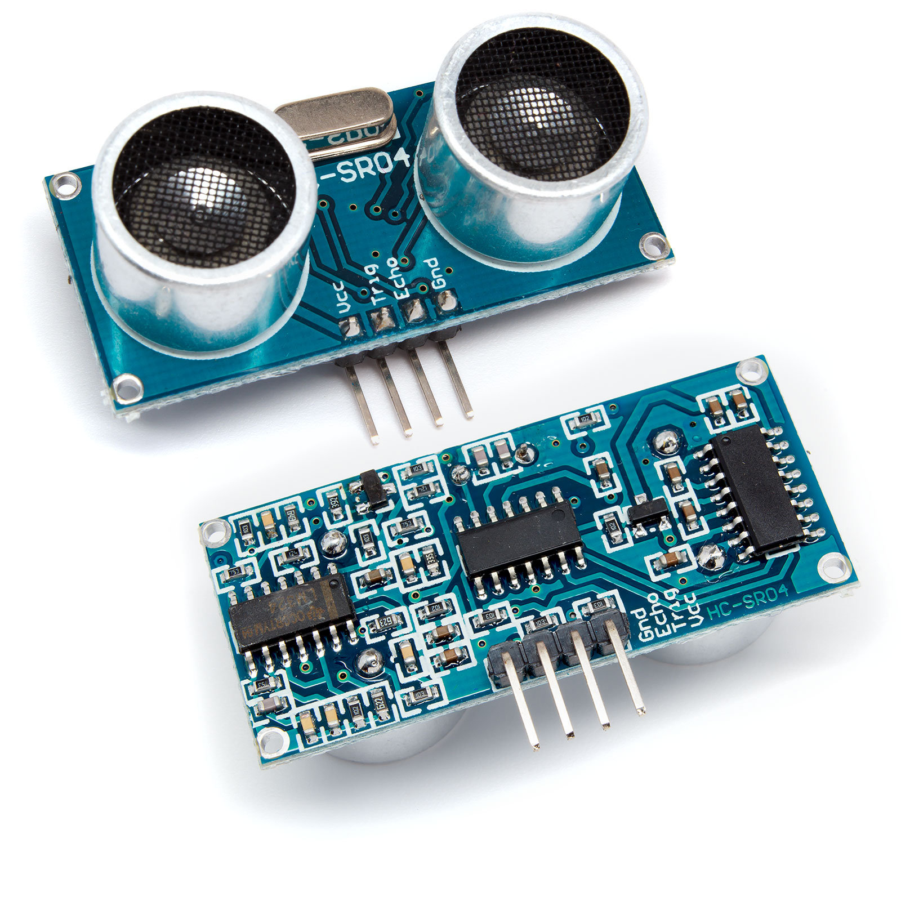

# HC-SR04
Arduino communication library for the HC-SR04 ultrasonic sensor.



###### Features:

- Simple usage

- Advance usage:

  - Global, Dynamic, Combined parameter specification
  - Builder

  - Specify samples
  - Specify temperature (Celsius, Fahrenheit)
  - Specify measurement distance (Centimeters, Meters, Inches, Foot, Yards)
  - Specify max distance (Centimeters, Meters, Inches, Foot, Yards)
  - Specify response timeout (Milliseconds)

- One & Two wire mode.

- Error Statistics (Signal Timed Out Count, Response Timed Out Count, Max Distance Exceeded)


In the examples the HC-SR04 is used in **one wire mode**. The library **supports one and two wires**.


##### Simple example:

```c++
#include <Arduino.h>
#include <SerialPrintF.h>
#include "HCSR04.h"

#define SERIAL_BAUD_RATE 9600
#define HCSR04_ONE_WIRE_PIN 9

HCSR04 hcsr04(HCSR04_ONE_WIRE_PIN);

void setup() {
    Serial.begin(SERIAL_BAUD_RATE);
}

void loop() {
    
    Measurement measurement = hcsr04.measure();

    serial_printf(Serial,
                  "Distance: %2f %s, Valid Samples: %l/%i [Signal Timed Out Count: %i, Response Timed Out Count: %i, Max Distance Exceeded Count: %i]\n",
                  measurement.getDistance(), getDistanceUnitAbbreviation(measurement.getDistanceUnit()),
                  measurement.getValidMeasurementsCount(),
                  measurement.getTakenSamples(),
                  measurement.getSignalTimedOutCount(),
                  measurement.getResponseTimedOutCount(),
                  measurement.getMaxDistanceExceededCount());
}
```

##### Advanced Usage: (Global)

```c++
#include <Arduino.h>
#include <SerialPrintF.h>
#include "HCSR04.h"

#define SERIAL_BAUD_RATE 9600
#define HCSR04_ONE_WIRE_PIN 9

HCSR04 hcsr04(HCSR04_ONE_WIRE_PIN);

void setup() {
    Serial.begin(SERIAL_BAUD_RATE);

    hcsr04.setDefaultSamples(5);
    hcsr04.setDefaultTemperature(21.55, TemperatureUnit::CELSIUS);
    hcsr04.setDefaultMaxDistance(1, DistanceUnit::METERS);
    hcsr04.setDefaultMeasurementDistanceUnit(DistanceUnit::CENTIMETERS);
    hcsr04.setDefaultResponseTimeoutMS(300);
}

void loop() {


    Measurement measurement = hcsr04.measure();

    serial_printf(Serial,
                  "Distance: %2f %s, Valid Samples: %l/%i [Signal Timed Out Count: %i, Response Timed Out Count: %i, Max Distance Exceeded Count: %i]\n",
                  measurement.getDistance(), getDistanceUnitAbbreviation(measurement.getDistanceUnit()),
                  measurement.getValidMeasurementsCount(),
                  measurement.getTakenSamples(),
                  measurement.getSignalTimedOutCount(),
                  measurement.getResponseTimedOutCount(),
                  measurement.getMaxDistanceExceededCount());
}
```

##### Advanced Usage: (Dynamic)

```c++
#include <Arduino.h>
#include <SerialPrintF.h>
#include "HCSR04.h"

#define SERIAL_BAUD_RATE 9600
#define HCSR04_ONE_WIRE_PIN 9

HCSR04 hcsr04(HCSR04_ONE_WIRE_PIN);

void setup() {
    Serial.begin(SERIAL_BAUD_RATE);
}

void loop() {


    Measurement measurement = hcsr04.measure(
            MeasurementConfiguration::builder()
                        .withSamples(5)
                        .withTemperature(21.55,TemperatureUnit::CELSIUS)
                        .withMaxDistance(1,DistanceUnit::METERS)
                        .withMeasurementDistanceUnit(DistanceUnit::CENTIMETERS)
                        .withResponseTimeoutMS(300)
                        .build());
    
    serial_printf(Serial,
                  "Distance: %2f %s, Valid Samples: %l/%i [Signal Timed Out Count: %i, Response Timed Out Count: %i, Max Distance Exceeded Count: %i]\n",
                  measurement.getDistance(), getDistanceUnitAbbreviation(measurement.getDistanceUnit()),
                  measurement.getValidMeasurementsCount(),
                  measurement.getTakenSamples(),
                  measurement.getSignalTimedOutCount(),
                  measurement.getResponseTimedOutCount(),
                  measurement.getMaxDistanceExceededCount());
}
```

##### Advanced Usage: (Combined)

```c++
#include <Arduino.h>
#include <SerialPrintF.h>
#include "HCSR04.h"

#define SERIAL_BAUD_RATE 9600
#define HCSR04_ONE_WIRE_PIN 9

HCSR04 hcsr04(HCSR04_ONE_WIRE_PIN);

void setup() {
    Serial.begin(SERIAL_BAUD_RATE);

    hcsr04.setDefaultSamples(4);
    hcsr04.setDefaultResponseTimeoutMS(250);
}

void loop() {


    Measurement measurement = hcsr04.measure(
            MeasurementConfiguration::builder()
                        .withSamples(5)
                        .withTemperature(21.55,TemperatureUnit::CELSIUS)
                        .withMaxDistance(1,DistanceUnit::METERS)
                        .withMeasurementDistanceUnit(DistanceUnit::CENTIMETERS)
                        .withResponseTimeoutMS(300)
                        .build());

    serial_printf(Serial,
                  "Distance: %2f %s, Valid Samples: %l/%i [Signal Timed Out Count: %i, Response Timed Out Count: %i, Max Distance Exceeded Count: %i]\n",
                  measurement.getDistance(), getDistanceUnitAbbreviation(measurement.getDistanceUnit()),
                  measurement.getValidMeasurementsCount(),
                  measurement.getTakenSamples(),
                  measurement.getSignalTimedOutCount(),
                  measurement.getResponseTimedOutCount(),
                  measurement.getMaxDistanceExceededCount());
}
```


##### What is that Global,  Dynamic and Combined parameter specification?

- The idea behind the library is to give the user **flexibility** when using the library.

When measuring you can specify **different configurations parameters** for a **measurement**. 

If a parameter is not specified in configuration of the measurement, then the one set at the begging will be used and even if he is not specific then the default ones will be used.

Each of the rest configuration parameters that you have **not set** for the measurement will **come** either from the ones that you have **specified at the start** or the **default ones**.

That creates a priority, for example:

- If **samples** is not set in the `MeasurementConfiguration::builder().withSamples(5).build()`  check the default value `hcsr04.setDefaultSamples(4);` and even if the default value was not set get the one from the macro `#define DEFAULT_SAMPLES 3`

> With that you can specify different parameters at the start of the program and then use them globally, but also have the ability to overwrite them.

------

### Parameters:

###### Samples: (3)

   How many times to take measurement. Then the returned distance will be the average of a valid measurements.

###### Max Distance: (4 meters)

   The maximum distance that is allowed. If a measurement's distance exceeds it, then the measurement is invalid.

###### Temperature: (25 celsius)

  The ambient temperature.

  Increases the accuracy of the measurement, because the sound speed is dependent on temperature.

###### Response Timeout: (75 milliseconds)

  The maximum time to take a measurement.

  If the time is exceeded then the measurement is invalid. 

  Indication when there is something wrong with the communication to the device eg: not connected

###### Measurement Distance Unit: (Centimeters)

  In what distance unit the measurement will be returned.


> The content in the brackets is their default value.


------

